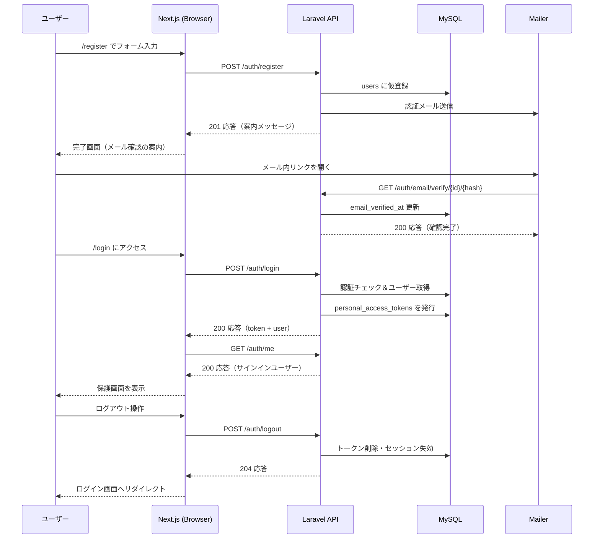

# 認証フロー

Laravel API（Sanctum）におけるユーザー登録・メール確認・ログイン・ログアウトの流れをシーケンス図にまとめます。

```mermaid
sequenceDiagram
    participant U as ユーザー
    participant FE as Next.js (Browser)
    participant BE as Laravel API
    participant DB as MySQL
    participant Mail as Mailer

    U->>FE: /register でフォーム入力
    FE->>BE: POST /auth/register
    BE->>DB: users に仮登録
    BE->>Mail: 認証メール送信
    BE-->>FE: 201 応答（案内メッセージ）
    FE-->>U: 完了画面（メール確認の案内）

    U->>Mail: メール内リンクを開く
    Mail->>BE: GET /auth/email/verify/{id}/{hash}
    BE->>DB: email_verified_at 更新
    BE-->>Mail: 200 応答（確認完了）

    U->>FE: /login にアクセス
    FE->>BE: POST /auth/login
    BE->>DB: 認証チェック＆ユーザー取得
    BE->>DB: personal_access_tokens を発行
    BE-->>FE: 200 応答（token + user）
    FE->>BE: GET /auth/me
    BE-->>FE: 200 応答（サインインユーザー）
    FE-->>U: 保護画面を表示

    U->>FE: ログアウト操作
    FE->>BE: POST /auth/logout
    BE->>DB: トークン削除・セッション失効
    BE-->>FE: 204 応答
    FE-->>U: ログイン画面へリダイレクト
```

> 補足: `/auth/me` の結果は React Query のキャッシュで共有し、ログアウト時に該当キーを無効化します。
