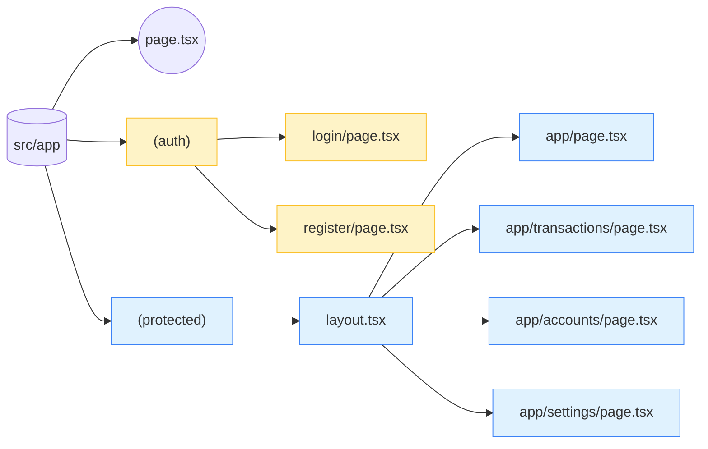

# ルーティング構成

Next.js App Router を利用し、認証有無でセグメントを分けています。

## ルーティングのポイント

- `(auth)` 配下は未ログイン時のみアクセス可能。ログイン済みであれば `/app` へリダイレクト。
- `(protected)` 配下は `AuthGuard` で `/auth/me` を確認し、未ログイン時は `/login` へ遷移。
- `routes/paths.ts` にルート定義をまとめ、UI からのリンクはここを参照する。
