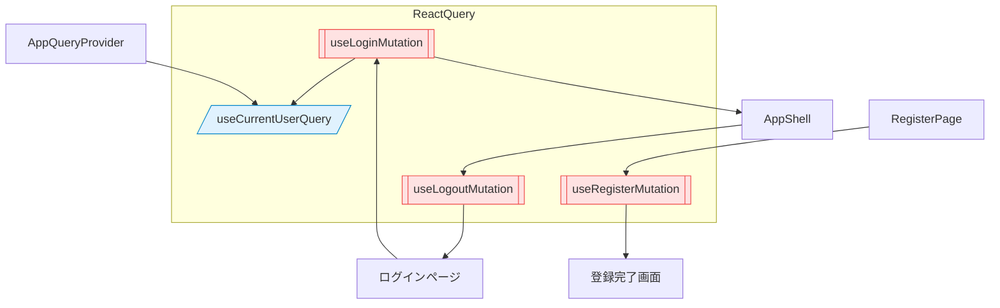

# 状態管理の概要

React Query を中心に認証状態とドメインデータを管理しています。以下の図は主要なクエリ・ミューテーションと、UI コンポーネントの依存関係を表します。

## 補足

- 認証周りのキャッシュキーは `authKeys` に統一し、ログアウト時は `removeQueries({ queryKey: authKeys.all })` で破棄。
- その他のドメインデータ（取引など）は別途 `src/lib/queries/` で管理予定。
