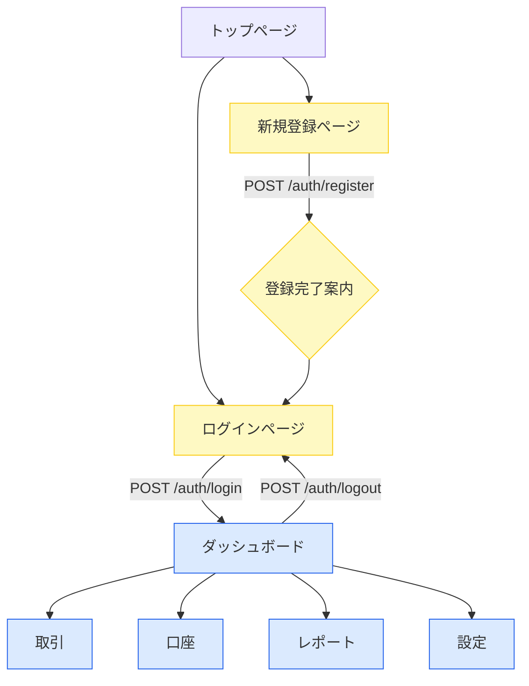

# フロントエンド UI フロー

次の図では、ユーザー登録・ログイン・ログアウト時の画面遷移とバックエンドとの連携を示します。

```mermaid
flowchart TD
    Home[トップページ] --> Login[ログインページ]
    Home --> Register[新規登録ページ]

    Register -->|POST /auth/register| RegisterSuccess{登録完了案内}
    RegisterSuccess --> Login

    Login -->|POST /auth/login| Dashboard[ダッシュボード]
    Dashboard -->|POST /auth/logout| Login

    Dashboard --> Transactions[取引]
    Dashboard --> Accounts[口座]
    Dashboard --> Reports[レポート]
    Dashboard --> Settings[設定]

    classDef auth fill:#fef9c3,stroke:#facc15;
    class Login,Register,RegisterSuccess auth;

    classDef protected fill:#dbeafe,stroke:#2563eb;
    class Dashboard,Transactions,Accounts,Reports,Settings protected;
```

> `/auth/register` は仮登録完了画面を挟み、メール内のリンクから検証済みとなったユーザーが `/login` へ遷移する想定です。
